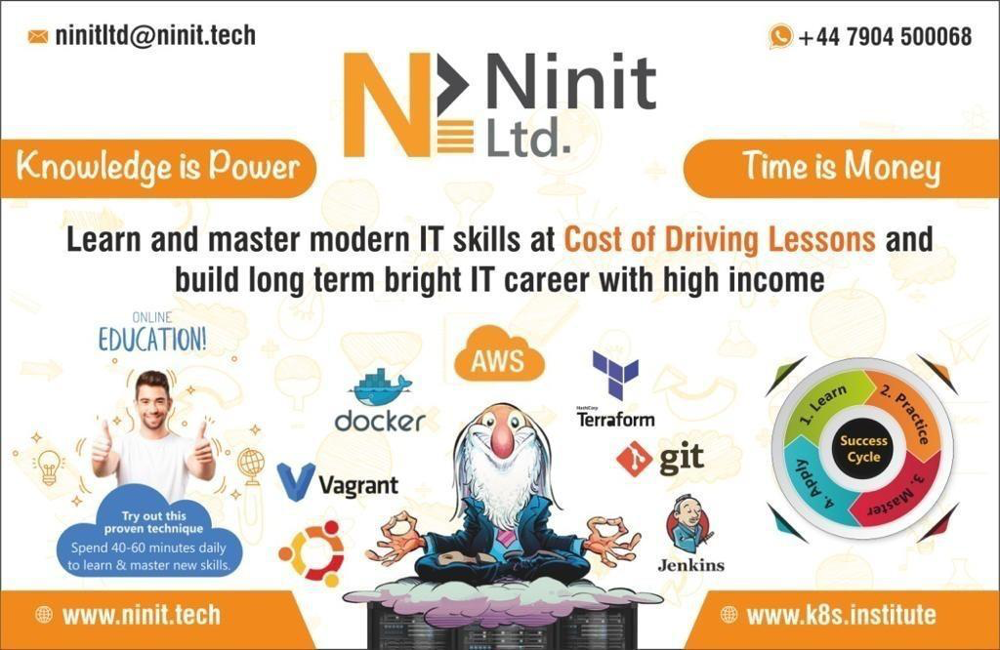

# DevOps and Cloud Engineer 101

### Aim:
> On completion of this course the participant will gain in-depth knowledge about Cloud Computing and related modern IT skills such as, Amazon Web Services (AWS), Source control system (GIT), Modern Serverless Architecture (AWS Lambda), Docker Containerization, (Ansible) Configuration management system, Fundamentals about API’s, Linux operating system and BASH Scripting.

> Participants will be confident around concepts of modern software delivery life cycle (SDLC) along with installation and management of basic services in the cloud. This course is designed for anyone who is interested in kick starting their IT career. Delegates will gain good hands-on experience to get a job with a good long term career opportunity. Most of the technical concepts will be taught using local virtual systems and containerisation to minimise cost.

### The delegate will acquire essential knowledge which will help them to become a good:
* DevOps Engineer.
* Build and Release Engineer.
* Site Reliability Engineer.
* Cloud SysOps Engineer.
* Infrastructure Automation Engineer. (IaC)

### Prerequisites:
* Delegates should have basic knowledge about at least one Operating
System. Preferred OS is any Linux distribution, Windows, OR Apple MAC.
* Delegates will need to bring their own Laptop.
